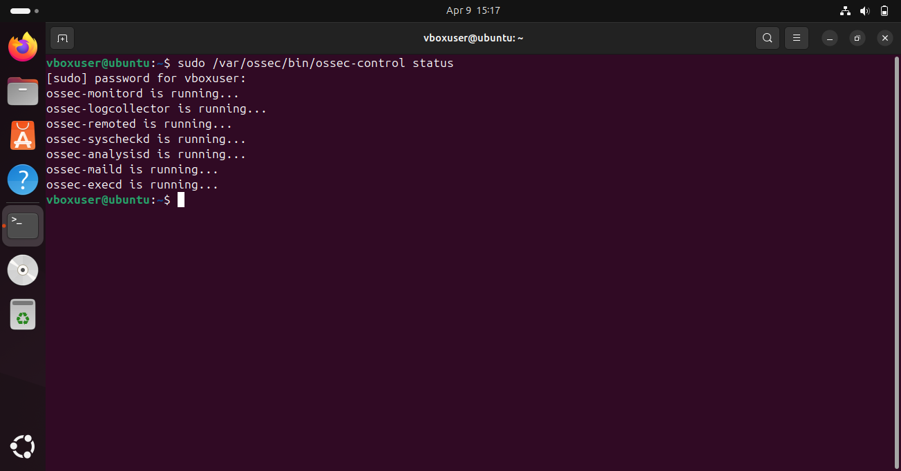
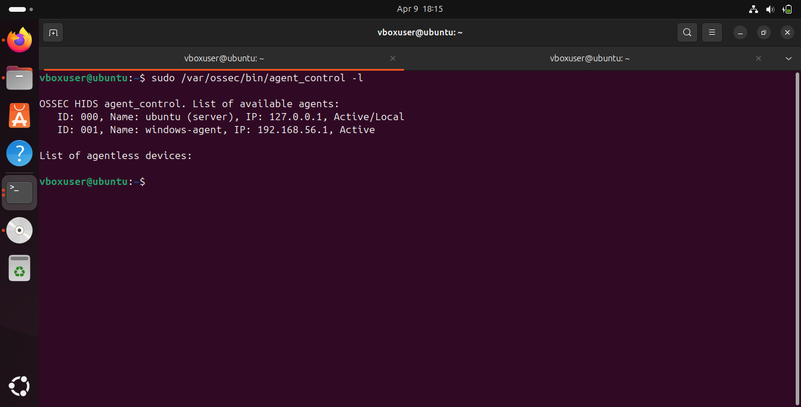
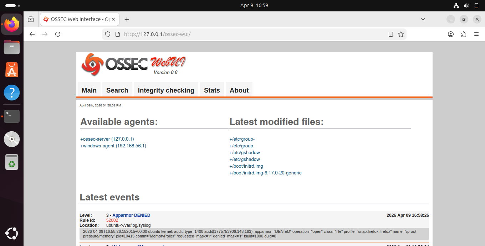
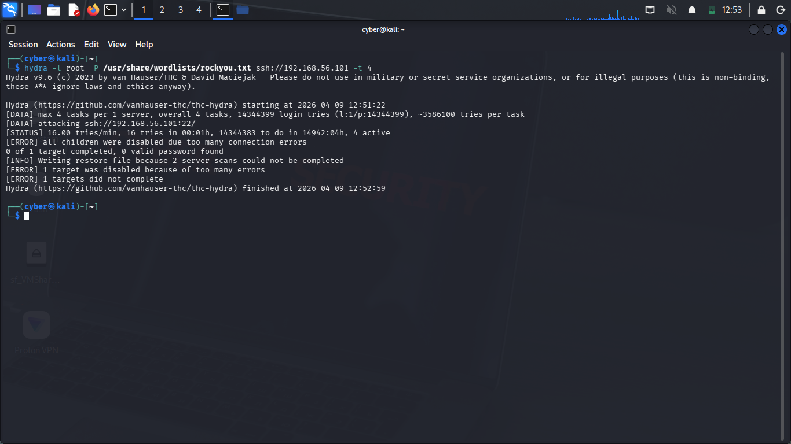
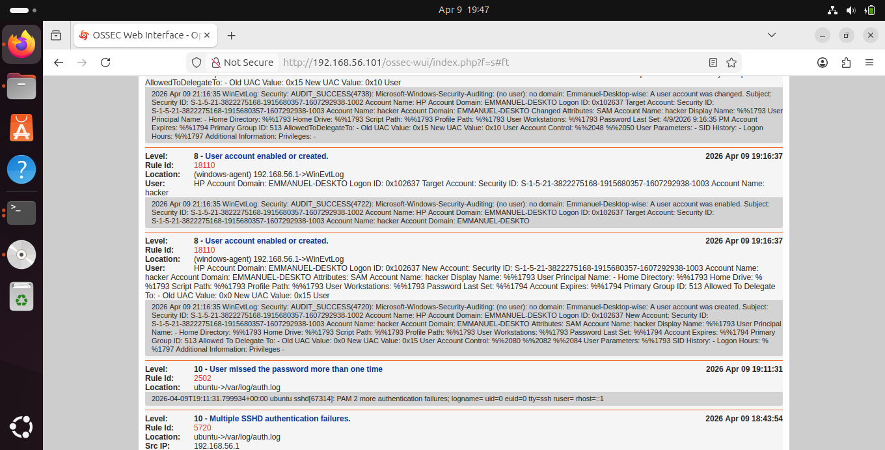
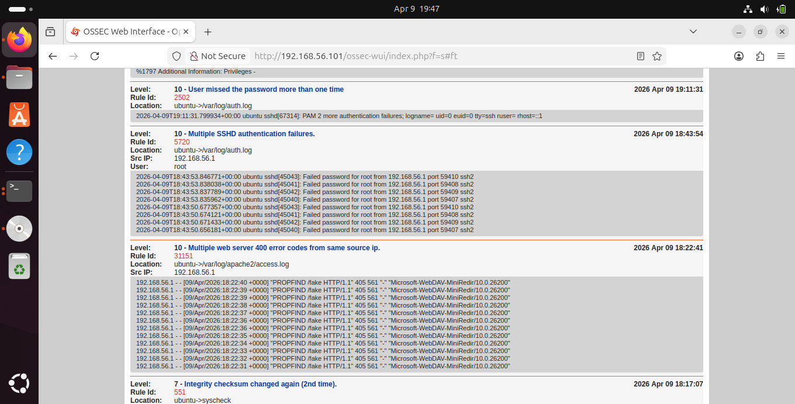
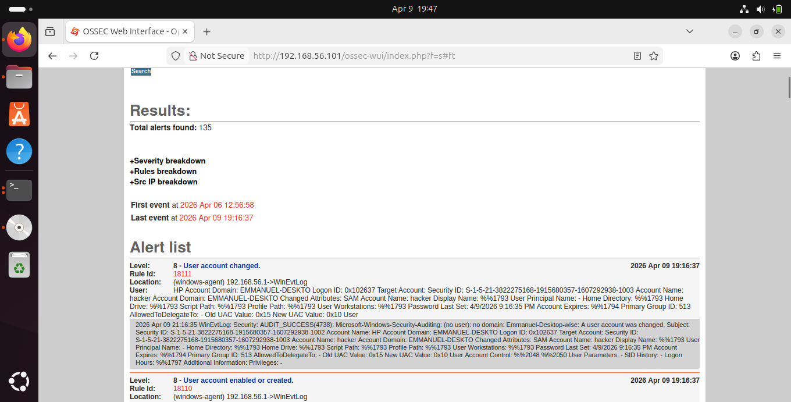

# 🛡️ Host-Based Intrusion Detection System (HIDS) Lab — OSSEC


---

## Objective

This project demonstrates the full deployment and operation of **OSSEC**, an open-source Host-based Intrusion Detection System (HIDS), in a multi-machine virtual lab environment. The lab simulates real-world attack scenarios and shows how a HIDS monitors, detects, and automatically responds to threats at the host level.

Key areas covered:
- SSH brute-force detection and automated IP blocking via Active Response
- File integrity monitoring on critical system files
- Centralized Windows endpoint monitoring via OSSEC agent
- Web attack detection through Apache log analysis
- Real-time alert visualization through the OSSEC Web UI


---

## Lab Architecture

```
┌─────────────────────────────────────────────────────────────────────┐
│                    VIRTUALBOX HOST (Windows PC)                      │
│                         192.168.56.1                                 │
│                                                                       │
│   ┌──────────────────┐    attacks     ┌──────────────────────────┐  │
│   │   KALI LINUX     │ ─────────────▶ │      UBUNTU 22.04        │  │
│   │   (Attacker)     │                │   (OSSEC Server + WebUI) │  │
│   │  192.168.56.xxx  │                │     192.168.56.101        │  │
│   └──────────────────┘                └────────────┬─────────────┘  │
│                                                     │                │
│                                              collects logs           │
│                                                     ▼                │
│                                      ┌──────────────────────────┐   │
│                                      │     WINDOWS HOST         │   │
│                                      │    (OSSEC Agent)         │   │
│                                      │     192.168.56.1         │   │
│                                      └──────────────────────────┘   │
└─────────────────────────────────────────────────────────────────────┘
```

| Machine | Role | OS | IP Address |
|---|---|---|---|
| **Kali Linux** | Attacker | Kali Linux (Rolling) | 192.168.56.xxx |
| **Ubuntu VM** | OSSEC Server + Web UI | Ubuntu 22.04 LTS | 192.168.56.101 |
| **Windows Host** | OSSEC Agent (Monitored Endpoint) | Windows 10/11 | 192.168.56.1 |

### Role of Each Machine

**🔴 Kali Linux — The Attacker**
Simulates a real-world threat actor. Used Hydra for SSH brute-force attacks and web enumeration to generate detectable malicious activity against the monitored systems.

**🟢 Ubuntu VM — The OSSEC Server**
The brain of the entire lab. Runs the OSSEC analysis engine, collects logs from all agents, fires detection rules, triggers automated Active Response, and hosts the Web UI dashboard.

**🟡 Windows Host — The OSSEC Agent**
A monitored endpoint with the OSSEC Windows agent installed. Forwards Windows Event Logs and security events to the Ubuntu OSSEC server in real time — simulating enterprise endpoint monitoring.

---

## Tools & Technologies
| Tool | Purpose |
|---|---|
| **OSSEC 3.7.0** | Host-based Intrusion Detection System |
| **OSSEC Web UI v0.8** | Browser-based alert dashboard |
| **Apache2 + PHP 7.3** | Web server hosting the OSSEC Web UI |
| **Hydra v9.6** | SSH brute-force simulation (attacker tool) |
| **UFW / iptables** | Firewall managed by OSSEC Active Response |
| **VirtualBox** | Virtualization platform for the lab |
| **OpenSSH Server** | SSH service running on Ubuntu (attack target) |
| **OSSEC Windows Agent** | Endpoint monitoring agent on Windows host |

---

## OSSEC Features Demonstrated

| Feature | Description |
|---|---|
| **Log Analysis** | Monitors `/var/log/auth.log`, Apache logs, syslog, and Windows Event Logs |
| **File Integrity Monitoring** | Detects unauthorized file changes using MD5/SHA1 baseline hashing |
| **Active Response** | Automatically blocks attacker IPs via iptables — zero human intervention |
| **Windows Agent Monitoring** | Collects and forwards Windows security events to the central server |
| **Web UI Dashboard** | Visualizes all alerts, agents, and integrity results in a browser |
| **Alert Correlation** | Groups related events into pattern-based high-severity alerts |

---

## Installation & Setup

### Prerequisites
- VirtualBox installed on Windows host
- Ubuntu 22.04 VM (minimum 4GB RAM, 20GB disk)
- Kali Linux VM
- All machines on Host-Only network (`192.168.56.0/24`)

### 1. Install Dependencies on Ubuntu
```bash
sudo apt update && sudo apt upgrade -y
sudo apt install -y build-essential gcc make libssl-dev \
  libpcre2-dev zlib1g-dev libsystemd-dev wget curl \
  inotify-tools apache2 php7.3 libapache2-mod-php7.3
```

### 2. Download & Install OSSEC Server
```bash
cd /tmp
wget https://github.com/ossec/ossec-hids/archive/3.7.0.tar.gz
tar -xzf 3.7.0.tar.gz
cd ossec-hids-3.7.0
sudo ./install.sh
```

**Installation answers:**
```
Installation type:        server
Email notifications:      n
Integrity check daemon:   y
Rootkit detection:        y
Active response:          y
Firewall-drop response:   y
```

### 3. Add Windows Agent & Extract Key
```bash
sudo /var/ossec/bin/manage_agents
# A → Add agent: Name=windows-agent, IP=192.168.56.1
# E → Extract key for agent 001 — copy this key
# Q → Quit
```

### 4. Start OSSEC & Verify
```bash
sudo /var/ossec/bin/ossec-control start
sudo /var/ossec/bin/ossec-control status
```

### 5. Verify Both Agents Connected
```bash
sudo /var/ossec/bin/agent_control -l
```

Expected output:
```
ID: 000, Name: ubuntu (server), IP: 127.0.0.1,   Active/Local
ID: 001, Name: windows-agent,   IP: 192.168.56.1, Active
```

### 6. Install OSSEC Web UI
```bash
cd /tmp
wget https://github.com/ossec/ossec-wui/archive/refs/heads/master.zip
unzip master.zip
sudo mv ossec-wui-master /var/www/html/ossec-wui
sudo adduser www-data ossec
sudo chown -R www-data:ossec /var/ossec/logs
sudo systemctl restart apache2
```

> **Note:** OSSEC Web UI requires **PHP 7.3** due to array syntax deprecated in PHP 8.x.

### 7. Install Windows Agent
- Download `ossec-agent-win32-2.0.exe` from OSSEC GitHub releases
- Run as Administrator on Windows
- Set **Manager IP**: `192.168.56.101`
- Paste the authentication key extracted in Step 3
- Click **Start Service**

---

## Lab Setup

### OSSEC Server — All Processes Running


### Both Agents Active


### OSSEC Web UI Dashboard


---

## 🔴 Demo 1 — SSH Brute Force Detection & Active Response

**Attack from Kali using Hydra:**
```bash
hydra -l root -P /usr/share/wordlists/rockyou.txt ssh://192.168.56.101 -t 4
```



> Hydra terminated with "all children were disabled due to too many connection errors" — OSSEC Active Response automatically blocked the attacking IP via iptables

**Alerts generated:**
```
Rule 5503  (Level 5)  → User login failed
Rule 5716  (Level 5)  → SSHD authentication failed  
Rule 5720  (Level 10) → Multiple SSHD authentication failures — BRUTE FORCE DETECTED
```

**Auto-block confirmed:**
```bash
sudo iptables -L -n | grep DROP
# DROP  0  --  192.168.56.1  0.0.0.0/0
```

---

## 🔴 Demo 2 — File Integrity Monitoring (FIM)

**Simulated attacker tampering with system files:**
```bash
sudo touch /etc/hacked.txt
sudo echo "attacker backdoor" | sudo tee -a /etc/passwd
```

**OSSEC alert:**
```
Rule 550  (Level 7) → Integrity checksum changed
Rule 551  (Level 7) → Integrity checksum changed again (2nd time)
Location: ubuntu->syscheck
```

> OSSEC maintains MD5/SHA1 baselines of monitored files and immediately alerts when any hash changes — even a single byte modification is detected

---

## 🔴 Demo 3 — Windows Agent Endpoint Monitoring

**Windows security events forwarded to OSSEC server:**



**Alerts captured from Windows endpoint:**
```
Rule 18111 (Level 8) → User account changed       — windows-agent 192.168.56.1->WinEvtLog
Rule 18110 (Level 8) → User account enabled/created — windows-agent 192.168.56.1->WinEvtLog
```

> Windows Event Log activity captured by the OSSEC agent and forwarded to Ubuntu in real time — total of 135 alerts collected across both agents demonstrating centralized multi-platform monitoring

---

## 🔴 Demo 4 — Web Attack Detection

**Multiple web 400 errors from same source detected:**



**Alert fired:**
```
Rule 31151 (Level 10) → Multiple web server 400 error codes from same source IP
Location: ubuntu->/var/log/apache2/access.log
Src IP:   192.168.56.1
```

> OSSEC monitors Apache access logs and correlates repeated 400 errors into a high-severity alert — indicating active web scanning or attack behaviour

---

## 🔴 Demo 5 — Authentication Failure Correlation

**OSSEC correlated repeated authentication failures:**



**Alerts fired:**
```
Rule 2502  (Level 10) → User missed the password more than one time
Rule 5720  (Level 10) → Multiple SSHD authentication failures
Src IP: 192.168.56.1
```

> This demonstrates OSSEC's rule correlation engine — individual failed logins are Level 5, but OSSEC groups them into a Level 10 pattern-based alert. This is what separates a HIDS from simple log viewing.

---

## 📊 Alert Summary Table

| Rule | Level | Severity | Description | Source |
|---|---|---|---|---|
| 5503 | 5 | Medium | User login failed | auth.log |
| 5716 | 5 | Medium | SSHD authentication failed | auth.log |
| **5720** | **10** | **🔴 Critical** | **Multiple SSHD failures — Brute Force** | auth.log |
| 550 | 7 | High | Integrity checksum changed | syscheck |
| 551 | 7 | High | Integrity checksum changed again | syscheck |
| 18110 | 8 | High | User account enabled/created | WinEvtLog |
| 18111 | 8 | High | User account changed | WinEvtLog |
| **31151** | **10** | **🔴 Critical** | **Multiple web 400 errors — Web Attack** | Apache |
| **2502** | **10** | **🔴 Critical** | **User missed password multiple times** | auth.log |

**Total alerts captured during lab: 135**

---

## Key Takeaways

**HIDS vs NIDS**
OSSEC operates at the host level by reading log files and monitoring system state. Unlike network IDS tools such as Snort which inspect network packets, OSSEC detects threats that have already reached the host. In production both are deployed together for complete coverage.

**Active Response**
OSSEC goes beyond detection — it automatically responds to threats by modifying firewall rules in real time. When brute-force was detected, the attacker IP was blocked without any manual intervention, demonstrating automated defense.

**Centralized Multi-Platform Monitoring**
A single OSSEC server simultaneously monitored a Linux server and a Windows endpoint, mirroring how enterprise SOC environments aggregate logs from diverse systems into one detection platform.

**Alert Correlation**
A single failed login is noise. Eight failed logins in 30 seconds from the same IP is an attack. OSSEC's correlation engine makes this distinction automatically — turning raw log data into actionable security intelligence.

---

## Repository Structure

```
OSSEC-HIDS-Lab/
├── README.md
├── screenshots/
│   ├── ossec-status.png           ← All OSSEC daemons running
│   ├── agents-active.png          ← Both agents showing Active
│   ├── ossec-ui-1.png             ← Web UI main dashboard
│   ├── ossec-ui-2.png             ← Web UI latest events
│   ├── hydra-attack-kali.png      ← Hydra blocked by Active Response
│   ├── ossec-alerts-search.png    ← 135 alerts, brute force correlation
│   ├── windows-agent-alerts.png   ← Windows endpoint alerts
│   └── web-attack-alerts.png      ← Web attack + FIM alerts
└── 
```

---

## Conclusion
This project demonstrates the practical implementation of a Host-Based Intrusion Detection System and highlights the importance of endpoint monitoring in cybersecurity. It reflects real-world blue team operations including detection, analysis, and incident awareness.

## Author

**Emmanuel Siamoonga**
Network and Cloud Security

[](https://linkedin.com/in/yourprofile)
[](https://github.com/yourusername)

> *"Security is not a product, but a process."* — Bruce Schneier
